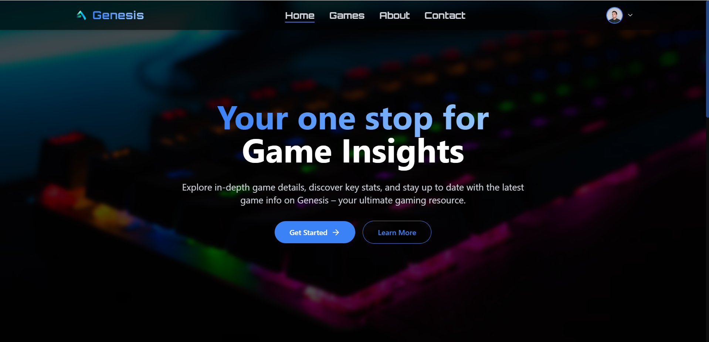
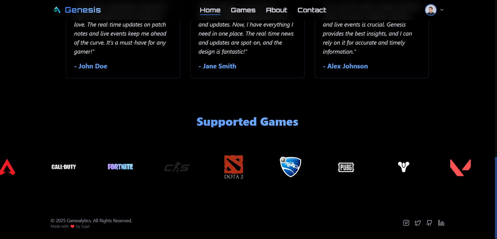
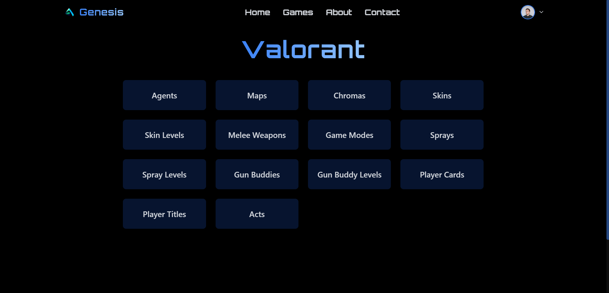

Here’s a detailed **README.md** template for **Genesis**:

---

# Genesis: Your Ultimate Game Information Platform

Genesis is your go-to platform for static game information. It provides detailed insights into the most popular games available today, including key statistics, game features, and essential updates. Whether you're a casual gamer or a hardcore enthusiast, Genesis helps you stay informed about your favorite games with ease.

## Table of Contents
1. [Project Overview](#project-overview)
2. [Features](#features)
3. [Tech Stack](#tech-stack)
4. [Installation](#installation)
5. [Usage](#usage)
6. [Contributing](#contributing)
7. [License](#license)
8. [Contact](#contact)

## Project Overview

Genesis is designed to be a reliable platform for gamers who want to learn more about the games they love. Unlike player-specific tracking platforms, Genesis focuses solely on **static game content**, offering detailed information on various aspects such as:

- **Game details**: Overview, release date, genre, and more
- **Game features**: Key gameplay elements and what makes each game unique
- **Real-time updates**: Latest news and updates for your favorite games
- **Upcoming releases**: Stay ahead of the curve with the latest game release announcements

The goal of Genesis is to offer accurate, up-to-date information to help users stay connected with the gaming world without diving into player statistics.

### **Website**





## Features

- **Game Information**: A well-organized database of games, showcasing important details such as release dates, genres, and game mechanics.
- **Real-Time Updates**: Get the latest news, patch notes, and updates for games directly on the platform.
- **Game Insights**: Insights on game mechanics, features, and critical aspects of gameplay.
- **User-Friendly Interface**: A clean, modern UI/UX to enhance the user experience.
- **Responsive Design**: A mobile-friendly layout for users on various devices.
- **Easy Navigation**: Filter and search through a collection of games with intuitive design.

### Key Features of Genesis:
1. **Game Overview**: Detailed game descriptions, including release dates, platforms, and genres.
2. **Game Mechanics**: Explains core gameplay elements and highlights.
3. **Game Updates**: Stay informed with the latest patch notes, events, and upcoming releases.
4. **Real-Time API Integration**: Pulls data from free public APIs for up-to-date information.

## Tech Stack

Genesis is built with the following technologies:

- **Frontend**:
  - React.js for building the user interface
  - Tailwind CSS for responsive and utility-first styling
  - Framer Motion for smooth animations
  - React Router for managing navigation

- **Backend**:
  - Node.js with Express for handling API requests and routing
  - MongoDB for storing game-related data and user sessions

- **Authentication**:
  - Firebase for user authentication (Google sign-in, email/password login), JSON Web Tokens
  
- **Deployment**:
  - Deployed on Vercel (Frontend) and Render (Backend)

## Installation

To run Genesis locally on your machine, follow the steps below.

### Prerequisites

Make sure you have the following installed on your system:

- **Node.js** (v14.x or later)
- **MongoDB** (For local development, or use a cloud MongoDB service like [MongoDB Atlas](https://www.mongodb.com/cloud/atlas))
- **Firebase Project** (for authentication setup)

### Setting up the Project

1. **Clone the repository**:
   ```bash
   git clone https://github.com/your-username/genesis.git
   cd genesis
   ```

2. **Install the frontend dependencies**:
   ```bash
   cd frontend
   npm install
   ```

3. **Install the backend dependencies**:
   ```bash
   cd backend
   npm install
   ```

4. **Setup environment variables**:
   - Create a `.env` file in both the **frontend** and **backend** directories. 
   - Add necessary environment variables such as Firebase credentials, MongoDB connection string, and any API keys required.

   Example for the **backend** `.env`:
   ```bash
   MONGODB_URI=your_mongodb_connection_string
   PORT=5000
   FIREBASE_API_KEY=your_firebase_api_key
   ```

   Example for the **frontend** `.env`:
   ```bash
   REACT_APP_FIREBASE_API_KEY=your_firebase_api_key
   REACT_APP_FIREBASE_AUTH_DOMAIN=your_firebase_auth_domain
   REACT_APP_FIREBASE_PROJECT_ID=your_firebase_project_id
   ```

5. **Run the backend**:
   ```bash
   cd backend
   npm start
   ```
   This will start the backend server on `http://localhost:5000`.

6. **Run the frontend**:
   ```bash
   cd frontend
   npm run dev
   ```
   This will start the frontend server on `http://localhost:5173`.

Now, you can navigate to `http://localhost:5173` to see the application running locally.

## Usage

Once the app is up and running, users can:

- **Browse games**: Explore various game information like release dates, genres, and features.
- **Get real-time updates**: Stay informed with the latest game news and patch notes.
- **Search and Filter**: Use the search feature to find games by name, genre, or platform.
- **Authentication**: Users can log in or sign up to access additional features like saving favorite games or commenting on updates.

### Game Details Page
Each game has a dedicated page that provides:
- A brief description
- Key features
- Genre
- Release date
- Platforms supported

### Real-Time Updates Section
Get the latest news, patches, and events related to the games you're interested in, directly within the app.

## Contributing

We welcome contributions to make Genesis better! To contribute:

1. Fork the repository
2. Create a new branch (`git checkout -b feature/your-feature`)
3. Make your changes
4. Commit your changes (`git commit -am 'Add feature'`)
5. Push to the branch (`git push origin feature/your-feature`)
6. Open a pull request

## License

You may not modify, distribute, or sell this software. You are permitted to use it for personal purposes only. The software is provided "as-is" without warranty.

## Contact

- **GitHub**: [Genesis GitHub Repository](https://github.com/your-username/genesis)
- **Email**: your-email@example.com
- **Twitter**: [@yourusername](https://twitter.com/yourusername)

---
